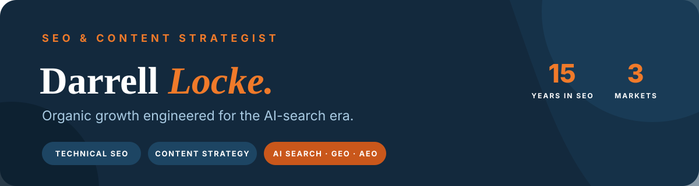

  

# SEO & Content Strategy Portfolio

This repository presents the work, methodology, and selected team-delivered results of **Darrell Locke**, an SEO & Content Strategist with **15 years in organic growth** across the U.S., Canada, and international markets.

[**Open the complete visual portfolio (PDF) →**](./Darrell-Locke-SEO-Content-Strategy-Portfolio-2026.pdf)

## Positioning

I treat organic growth as an engineering problem: connect demand to a disciplined keyword architecture, build a technically sound site, produce entity-rich content, and strengthen authority across both traditional search and the emerging AI citation economy.

My current focus combines **technical SEO**, **content strategy**, **international and local SEO**, **Generative Engine Optimization (GEO)**, **Answer Engine Optimization (AEO)**, and **entity-first topical authority**.

## Core Expertise

| Search strategy | Technical foundation | Content systems | AI search |
|---|---|---|---|
| Keyword architecture | Site architecture | Entity-led briefs | GEO and AEO |
| Intent and opportunity mapping | Crawlability and indexation | Topical clusters and silos | AI Overview optimization |
| Competitive and market analysis | Internal linking | Programmatic pages | Entity SEO |
| Local and international SEO | Core Web Vitals | Conversion-focused copy | Citation-ready answer blocks |
| Revenue and growth analytics | Structured data and schema | Editorial planning | AI platform visibility |

## Featured Case Studies

The metrics below come from international programs delivered as part of a cross-market growth team. My role was **SEO & Content Strategist**. Metrics are reported from Google Search Console and third-party tools as documented in the portfolio.

### [Roseberry KSA - Real Estate & Lifestyle](./roseberry-ksa-case-study.md)

- **50.4M** search impressions and **537K** clicks over 16 months
- **71%** organic traffic growth
- **248** pages cited in AI search
- Organic visits from **34 countries**

### [Nasertrans - Logistics & Moving](./nasertrans-case-study.md)

- Clicks increased from **719 to 2.57K** in a six-month comparison (**+257%**)
- Impressions increased from **85.9K to 210K** (**+144%**)
- CTR improved from **0.8% to 1.2%** (**+50%**)
- Average position improved from **15.7 to 9.5**

### [ConcentSA - Commercial B2B Furniture](./concentsa-case-study.md)

- **3.49M** search impressions and **39.4K** commercial clicks over 16 months
- **#1-#2** organic positions across KSA
- **Seven commercial verticals** developed under one domain

## Additional International Team Engagements

- [roseberryksa.com](https://roseberryksa.com) - Real Estate & Lifestyle, Saudi Arabia
- [nasertrans.com](https://nasertrans.com) - Logistics & Moving, Egypt
- [concentsa.com](https://concentsa.com) - Commercial B2B Furniture, Saudi Arabia
- [turkan-landscape.com](https://turkan-landscape.com) - Landscaping & Outdoor, Saudi Arabia
- [turkan-eg.com](https://turkan-eg.com) - Landscape Architecture, Egypt
- [eurovan-eg.com](https://eurovan-eg.com) - Mobility & Light Commercial, Egypt and international
- [eurovantrading.com](https://eurovantrading.com) - Trading & Distribution, international
- [imtrust-eg.com](https://imtrust-eg.com) - Trust & Compliance, Egypt

## Five-Phase Organic Growth Framework

1. **Discover** - forensic audit, competitor gaps, intent mapping, and AI-citation footprint
2. **Strategize** - topical blueprint and opportunity sizing prioritized by traffic, difficulty, and business value
3. **Engineer** - indexation, schema, internal links, page speed, and Core Web Vitals remediation
4. **Produce** - entity-rich briefs and expert-led content mapped to one primary keyword per page
5. **Amplify** - authority signals, digital PR, and AI-engine citations across the answer economy

## Open Resources

[**Explore the SEO Growth Playbook →**](https://github.com/darrell0808-ops/seo-growth-playbook) for a reusable technical SEO audit checklist, AI-search readiness framework, search-led content brief, and keyword architecture template.

## Platforms & Measurement

Google Search Console · Google Analytics 4 · Semrush · Google Business Profile · Google AI Overviews · ChatGPT · Perplexity · Gemini · Copilot · Grok

## Confidentiality

U.S. client names and performance data are protected under NDA. The public case studies in this repository are international engagements presented with explicit team attribution.

## Rights & Use

This portfolio and its case studies are published for professional review. No license file is provided; standard copyright rules apply. Do not reuse client names, metrics, visuals, or narrative as your own work.

## Work With Me

I'm open to **senior remote SEO roles, consulting engagements, and agency partnerships** across the U.S. and Canada.

[Email Darrell Locke](mailto:darrell0808@gmail.com) · [View my GitHub profile](https://github.com/darrell0808-ops)
